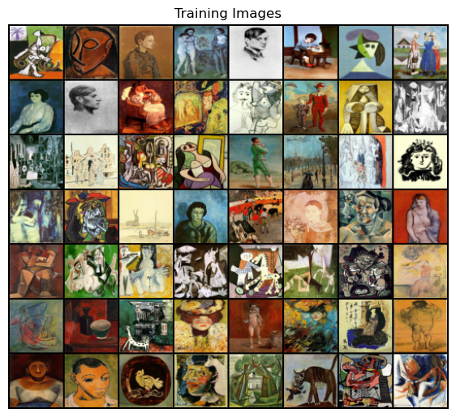

# Image-creation-using-DCGANs

A Deep Convolutional Generative Adversarial Network (DCGAN) is a type of GAN that leverages convolutional layers in both its generator and discriminator networks, making it particularly effective at generating realistic images.

## Key Components:
* **Generator:** This network takes in random noise (usually a vector from a normal distribution) and upsamples it through transposed convolutional layers (also known as "deconvolutions") to generate a realistic-looking image. Activation functions like ReLU and Tanh are commonly used.;
* **Discriminator:** This network is a convolutional neural network (CNN) that classifies images as real or fake by downsampling them through successive convolutional layers. It typically uses LeakyReLU as the activation function and outputs a probability score via a Sigmoid function.;

  
   
  https://wizardforcel.gitbooks.io/tensorflow-examples-aymericdamien/content/3.12_dcgan.html

## Used Architecture
**Generator:**
The generator takes a latent vector (z_dim dimensions) and progressively upscales it to generate a realistic image.
* Layers: It uses upsampling layers (Upsample), convolution layers (Conv2d), and batch normalization layers to refine the generated images.
* Activation: ReLU is used in most layers to introduce non-linearity, while Tanh at the output ensures pixel values are in the range [-1, 1].
The generator’s job is to learn a mapping from the latent space to an image space, creating synthetic images that resemble the training data.

**Discriminator:**
The discriminator is a convolutional neural network that takes an image as input and determines whether it is real or fake.
* Layers: It progressively downsamples the image through convolution and batch normalization layers, increasing the depth at each stage.
* Activation: LeakyReLU is used to introduce non-linearity, and Sigmoid at the end produces a probability output (0 for fake, 1 for real).
* Dropout: Added to certain layers to prevent overfitting and improve generalization.
The discriminator’s role is to learn to distinguish between real and generated (fake) images, providing feedback to the generator for improvement.

## General DCGAN Training Process
The training begins by feeding a batch of real images to the discriminator, which learns to identify them as real. After this, a batch of fake images is created by passing random noise through the generator, and these generated images are then fed into the discriminator. The discriminator’s loss is calculated based on how well it can correctly classify both real and fake images. The discriminator then updates its parameters via backpropagation to improve its ability to distinguish real images from fake ones.

Next, the generator is trained by generating a new batch of fake images and sending them to the discriminator. The generator’s loss is calculated based on how successfully it can fool the discriminator. Through backpropagation, the generator updates its parameters, gradually improving its ability to produce more realistic images.

This adversarial process, where each model improves at its specific task in response to the other’s training progress, continues iteratively over many epochs. Over time, the generator learns to create images that are increasingly indistinguishable from real ones, while the discriminator sharpens its ability to detect fakes. However, as training progresses and both networks improve, they reach a balance where the discriminator struggles to distinguish real images from fake ones created by the generator.

The training loop runs until a set stopping criterion is reached, whether it’s a certain number of epochs or the generator producing images of acceptable quality. Once training is complete, the generator can generate realistic images from random noise independently, while the discriminator is typically no longer needed. This adversarial training setup is key to DCGANs, pushing both models to improve iteratively, resulting in the generation of high-quality synthetic images.

  
   
  https://newsletter.theaiedge.io/p/how-generative-adversarial-networks

## Data Used

Data used to train the DCGAN are Paintings by the artist Rembrandt and Picasso. Those images where retrieved from the following dataset: https://www.kaggle.com/datasets/ikarus777/best-artworks-of-all-time

### Rembrandt Train Images

  

### Picasso Train Images

  
## Model Training 
Training the model following parameter were used: 
* LEARNING_RATE (3e-3): Step size for parameter updates; sometimes set separately for generator and discriminator.
* BATCH_SIZE (64): Number of samples per training batch.
* IMAGE_SIZE (64): Resolution for images used in training.
* CHANNELS_IMG (3): Number of color channels; 3 for RGB.
* Z_DIM (128): Dimension of the noise vector input to the generator.
* NUM_EPOCHS (400): Total passes over the training data.
* FEATURES_DISC (64) and FEATURES_GEN (64): Base number of filters in discriminator and generator, determining model capacity.

### Loss evaluation 

**First Graph** 
* Real Images (Blue): The discriminator’s probability for real images fluctuates but stabilizes around 0.65–0.7, indicating it’s somewhat confident in recognizing real images.
* Fake Images (Orange): The probabilities for fake images also fluctuate and tend to stabilize slightly lower, around 0.55–0.6, showing the discriminator is distinguishing between real and fake but with a relatively small gap.
* Interpretation: The training is likely progressing, but the discriminator isn’t strongly differentiating real from fake images. This can indicate either the generator is improving in realism or the discriminator may need tuning to increase confidence gaps.

  

 
 

**Second Graph**
* Real Images (Blue): The probabilities start higher and gradually stabilize between 0.65 and 0.7.
* Fake Images (Orange): The fake image probabilities also start higher but decrease over time, reaching around 0.55 or lower. There’s a clearer separation between real and fake probabilities compared to the first graph.
* Interpretation: This training run suggests better discriminator behavior, as it shows increasing confidence in distinguishing real from fake. The generator may be improving slower in realism, or the discriminator has become more effective.

  

## Images generated during training of DCCGAN
Based on Picasso Images

  

Based on Rembrandt Images

  

## Final generated images
### Rembrandt

   
  
  

### Picasso

   
  

